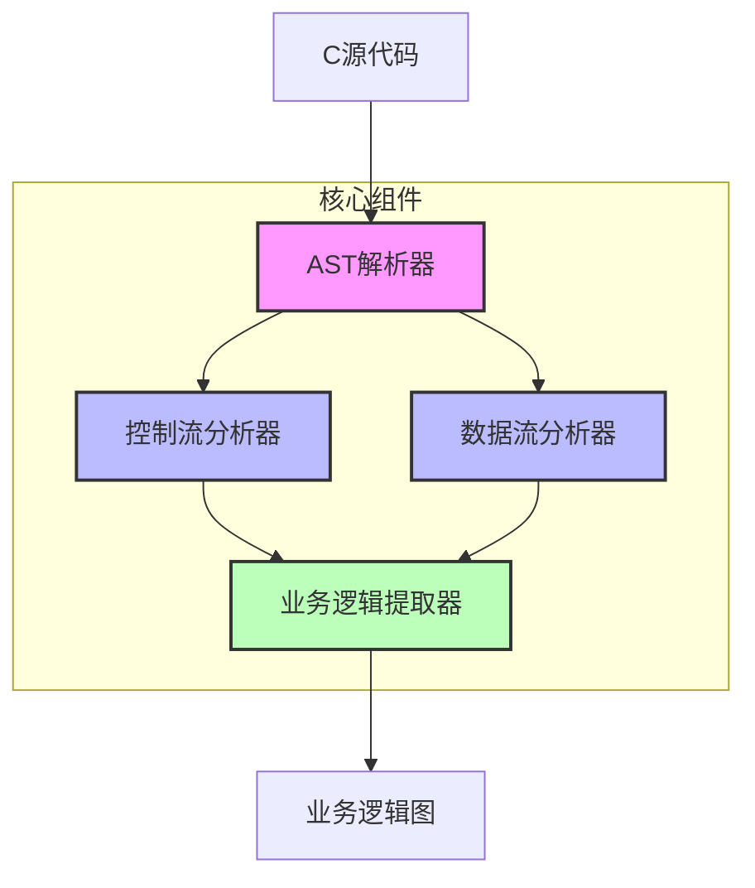
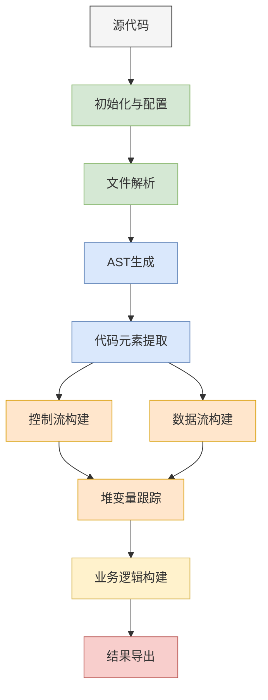
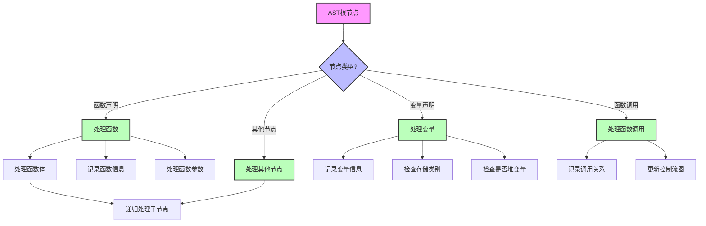

# C代码分析器设计文档

## 1. 概述

C代码分析器(`CCodeAnalyzer`)是一个强大的工具，用于分析C语言源代码，提取其中的业务逻辑、控制流和数据流信息。本文档详细介绍了分析器的设计原理、实现方法和关键算法。

## 2. 架构设计

### 2.1 核心组件

分析器由以下核心组件构成：

- **AST解析器**：基于libclang库解析C代码，生成抽象语法树(AST)
- **控制流分析器**：构建函数调用关系图，分析程序执行路径
- **数据流分析器**：跟踪变量定义和使用，分析数据依赖关系
- **业务逻辑提取器**：基于控制流和数据流信息，提取高层业务逻辑





*图2.1 C代码分析器架构图*

### 2.2 数据结构

分析器使用以下主要数据结构：

- **控制流图(CFG)**：使用NetworkX的有向图表示函数调用关系
- **数据流图(DFG)**：使用NetworkX的有向图表示变量依赖关系
- **业务逻辑图**：使用NetworkX的有向图表示业务模块及其依赖
- **变量信息字典**：存储变量的类型、存储类别、引用等信息
- **函数信息字典**：存储函数的参数、局部变量、调用关系等信息

## 3. 代码分析流程

### 3.1 初始化与配置

分析器初始化时会执行以下操作：

1. 配置libclang路径，尝试查找常见的LLVM安装位置
2. 初始化数据结构（控制流图、数据流图、变量信息等）
3. 确定要分析的文件列表（单个文件或目录中的所有C文件）

```python
def __init__(self, path, include_paths=None):
    """初始化C代码分析器
    Args:
        path: 可以是单个C文件的路径，也可以是包含C文件的目录路径
        include_paths: 包含头文件的路径列表
    """
    self.files = []
    if os.path.isdir(path):
        self.files.extend(glob.glob(os.path.join(path, '**/*.c'), recursive=True))
        self.files.extend(glob.glob(os.path.join(path, '**/*.h'), recursive=True))
    else:
        self.files.append(path)
    
    self.include_paths = include_paths or []
    self.index = clang.cindex.Index.create()
    self.cfg = nx.DiGraph()  # 控制流图
    self.dfg = nx.DiGraph()  # 数据流图
    self.variables = {}  # 变量信息
    self.global_vars = set()  # 全局变量
    self.static_vars = set()  # 静态变量
    self.heap_vars = set()  # 堆变量
    self.function_calls = []  # 函数调用
    self.business_logic = nx.DiGraph()  # 业务逻辑图
```

### 3.2 代码解析过程

分析器的主要分析流程如下：

1. **文件解析**：使用libclang解析每个C文件，生成AST
2. **代码元素提取**：递归遍历AST，提取函数、变量等代码元素
3. **控制流和数据流构建**：基于AST构建控制流图和数据流图
4. **堆变量跟踪**：识别和跟踪指向堆内存的指针变量
5. **业务逻辑构建**：基于控制流和数据流信息构建业务逻辑图

```python
def analyze(self):
    """执行完整的代码分析"""
    # 创建解析日志文件和临时目录
    # ...
    
    # 初始化functions属性
    self.functions = {}
    
    # 解析每个文件
    for file_path in self.files:
        # 准备编译参数，包括包含路径
        # ...
        
        # 解析翻译单元
        tu = self.index.parse(file_path, args, options=options)
        
        # 生成AST调试文件
        self._dump_ast(tu.cursor, f)
        
        # 解析代码元素和构建控制流图、数据流图
        self._parse_code_elements(tu.cursor)
        self._build_cfg_dfg(tu.cursor)
    
    # 跟踪堆变量和构建业务逻辑
    self._track_heap_variables()
    self._build_business_logic()
    return self
```





*图3.1 C代码分析主流程图*


## 4. AST解析与遍历

### 4.1 AST生成

分析器使用libclang库解析C代码，生成抽象语法树(AST)。为了提高解析成功率，分析器采取了以下策略：

1. 自动添加常见的标准库头文件路径
2. 支持相对路径和绝对路径的include语句
3. 提供详细的解析错误诊断信息
4. 使用多种解析选项，包括宽松解析选项

```python
# 使用详细的解析选项
options = clang.cindex.TranslationUnit.PARSE_DETAILED_PROCESSING_RECORD

# 尝试使用不同的解析选项
try:
    tu = self.index.parse(file_path, args, options=options)
except Exception as e1:
    # 添加更宽松的解析选项
    options |= clang.cindex.TranslationUnit.PARSE_INCOMPLETE
    tu = self.index.parse(file_path, args, options=options)
```

### 4.2 AST遍历与调试

分析器提供了详细的AST调试功能，可以将AST节点信息输出到文件中，便于开发者理解代码结构：

```python
def _dump_ast(self, cursor, file, level=0):
    """将AST节点信息输出到文件"""
    # 输出当前节点信息
    indent = '  ' * level
    file.write(f"{indent}Node: {cursor.kind.name}\n")
    file.write(f"{indent}Spelling: {cursor.spelling}\n")
    
    # 添加更详细的位置信息
    location_info = "未知位置"
    if cursor.location.file:
        location_info = f"{cursor.location.file}:{cursor.location.line}:{cursor.location.column}"
    file.write(f"{indent}Location: {location_info}\n")
    
    # 添加类型信息和更多详细信息
    file.write(f"{indent}Type: {cursor.type.spelling}\n")
    file.write(f"{indent}Type Kind: {cursor.type.kind}\n")
    file.write(f"{indent}Canonical Type: {cursor.type.get_canonical().spelling}\n")
    
    # 特殊节点类型的额外信息
    # ...
    
    # 递归处理子节点
    for child in cursor.get_children():
        self._dump_ast(child, file, level + 1)
```


​```mermaid
graph TD
    A[AST根节点] --> B{节点类型?}
    B -->|函数声明| C[处理函数]
    B -->|变量声明| D[处理变量]
    B -->|函数调用| E[处理函数调用]
    B -->|其他节点| F[处理其他节点]
    
    C --> G[记录函数信息]
    C --> H[处理函数参数]
    C --> I[处理函数体]
    
    D --> J[记录变量信息]
    D --> K[检查存储类别]
    D --> L[检查是否堆变量]
    
    E --> M[记录调用关系]
    E --> N[更新控制流图]
    
    I --> O[递归处理子节点]
    F --> O
    
    style A fill:#f9f,stroke:#333,stroke-width:2px
    style B fill:#bbf,stroke:#333,stroke-width:2px
    style C fill:#bfb,stroke:#333,stroke-width:2px
    style D fill:#bfb,stroke:#333,stroke-width:2px
    style E fill:#bfb,stroke:#333,stroke-width:2px
    style F fill:#bfb,stroke:#333,stroke-width:2px
```





*图4.1 AST遍历与代码元素识别流程*

## 5. 代码元素提取

### 5.1 函数分析

分析器能够识别函数声明和定义，并提取以下信息：

- 函数名称和返回类型
- 函数参数列表和类型
- 函数体范围（起始行和结束行）
- 函数调用关系
- 函数内的局部变量

```python
def _process_function_declaration(self, cursor, debug_file, parent_func=None):
    """处理函数声明和定义"""
    func_name = cursor.spelling
    
    # 记录函数定义信息到调试文件
    # ...
    
    # 处理函数定义和声明
    self.functions = getattr(self, 'functions', {})
    
    # 检查是否是函数定义
    is_def = cursor.is_definition()
    
    # 检查是否有函数体
    has_body = self._check_function_has_body(cursor)
    
    # 如果是函数定义且有函数体
    if is_def and has_body:
        self._process_function_definition(cursor, func_name)
    else:
        self._process_function_declaration_only(cursor, func_name)
```

### 5.2 变量分析

分析器能够识别变量声明，并提取以下信息：

- 变量名称和类型
- 变量存储类别（全局、静态、局部）
- 变量位置信息
- 变量引用关系
- 指针变量是否指向堆内存

```python
def _process_variable_declaration(self, cursor, debug_file, parent_func=None):
    """处理变量声明"""
    var_name = cursor.spelling
    var_type = cursor.type.spelling
    storage_class = cursor.storage_class
    
    # 记录变量分析信息到调试文件
    # ...
    
    # 记录变量信息
    var_info = {
        'type': var_type,
        'storage': storage_class,
        'location': f"{cursor.location.file}:{cursor.location.line}:{cursor.location.column}",
        'is_pointer': '*' in var_type,
        'references': [],
        'is_global': cursor.semantic_parent.kind == clang.cindex.CursorKind.TRANSLATION_UNIT,
        'is_static': storage_class == clang.cindex.StorageClass.STATIC,
        'is_heap': False,
        'parent_function': parent_func
    }
    
    # 只有全局变量和静态变量才添加到variables集合中
    if cursor.semantic_parent.kind == clang.cindex.CursorKind.TRANSLATION_UNIT or \
       storage_class == clang.cindex.StorageClass.STATIC:
        self.variables[var_name] = var_info
    
    # 如果是函数内的局部变量，添加到函数的局部变量列表
    if parent_func and parent_func in self.functions:
        self.functions[parent_func]['local_variables'].append({
            'name': var_name,
            'type': var_type,
            'location': var_info['location']
        })
    
    # 识别全局变量和静态变量
    if storage_class == clang.cindex.StorageClass.STATIC:
        self.static_vars.add(var_name)
        # 如果是文件作用域的静态变量，也将其添加到全局变量集合中
        if cursor.semantic_parent.kind == clang.cindex.CursorKind.TRANSLATION_UNIT:
            self.global_vars.add(var_name)
    elif cursor.semantic_parent.kind == clang.cindex.CursorKind.TRANSLATION_UNIT:
        self.global_vars.add(var_name)
    
    # 检查是否是堆分配变量
    if var_info['is_pointer']:
        self._check_heap_variable(cursor, var_name)
```

## 6. 控制流和数据流分析

### 6.1 控制流图构建

控制流图(CFG)表示程序的执行路径，主要包括函数调用关系。分析器通过以下步骤构建控制流图：

1. 为每个函数创建一个节点
2. 分析函数体中的函数调用
3. 为每个函数调用创建一条从调用者到被调用者的边

```python
def _build_cfg_dfg(self, cursor, parent_func=None):
    """构建控制流图和数据流图"""
    if cursor.kind == clang.cindex.CursorKind.FUNCTION_DECL:
        func_name = cursor.spelling
        
        # 检查是否是函数定义
        is_def = cursor.is_definition()
        
        # 检查是否有函数体
        has_body = False
        for child in cursor.get_children():
            if child.kind == clang.cindex.CursorKind.COMPOUND_STMT:
                has_body = True
                break
            # ...
        
        # 只处理函数定义，跳过纯声明
        if not is_def or not has_body:
            return
                
        # 添加函数节点到控制流图
        self.cfg.add_node(func_name, type='function', id=func_name, location=f"{cursor.location.file}:{cursor.location.line}:{cursor.location.column}")
        
        # 处理函数参数和函数内部
        # ...
                
    elif cursor.kind == clang.cindex.CursorKind.CALL_EXPR:
        # 记录函数调用
        called_func = cursor.spelling
        if parent_func and called_func:
            # 添加函数调用边到控制流图
            self.cfg.add_edge(parent_func, called_func)
            # 记录函数调用信息
            # ...
```

### 6.2 数据流图构建

数据流图(DFG)表示变量之间的依赖关系，主要包括变量定义和使用。分析器通过以下步骤构建数据流图：

1. 为每个变量创建一个节点
2. 分析变量的赋值和使用
3. 为变量之间的依赖关系创建边

```python
# 处理赋值等二元操作
elif cursor.kind == clang.cindex.CursorKind.BINARY_OPERATOR:
    lhs = None
    rhs = None
    
    for child in cursor.get_children():
        if not lhs:
            lhs = child
        else:
            rhs = child
            break
    
    if lhs and rhs:
        if lhs.kind == clang.cindex.CursorKind.DECL_REF_EXPR:
            lhs_name = lhs.spelling
            if lhs_name in self.variables:
                # 检查右侧是否是内存分配
                # ...
                
                # 添加到数据流图
                if rhs.kind == clang.cindex.CursorKind.DECL_REF_EXPR:
                    rhs_name = rhs.spelling
                    if rhs_name in self.variables:
                        self.dfg.add_edge(rhs_name, lhs_name, type='assignment')
```

### 6.3 堆内存分析

分析器能够识别和跟踪指向堆内存的指针变量，主要通过以下方法：

1. 识别内存分配函数调用（如malloc、calloc等）
2. 跟踪指针变量的赋值关系
3. 分析结构体成员指针

```python
def _check_heap_allocation(self, node):
    """检查节点是否表示堆内存分配"""
    if node is None:
        return False
        
    # 检查函数调用表达式
    if node.kind == clang.cindex.CursorKind.CALL_EXPR:
        # 获取函数名
        func_name = node.spelling.lower()
        
        # 检查标准内存分配函数
        if node.spelling in ['malloc', 'calloc', 'realloc', 'aligned_alloc', 'valloc', 'pvalloc']:
            return True
            
        # 检查自定义内存分配函数 - 更全面的模式匹配
        memory_alloc_patterns = ['alloc', 'new', 'create', 'dup', 'clone', 'copy']
        for pattern in memory_alloc_patterns:
            if pattern in func_name:
                return True
    # ...
    return False
```

## 7. 业务逻辑提取

### 7.1 业务模块识别

分析器能够基于控制流和数据流信息识别业务模块，主要通过以下方法：

1. 基于函数名称特征分类函数
2. 分析函数调用关系
3. 识别共享数据的函数组

```python
def _build_business_logic(self):
    """基于控制流图和数据流图构建业务逻辑框图"""
    # 定义业务模块
    business_modules = {
        'timer_system_initialization': ['timer_system_init'],
        'timer_creation': ['timer_create'],
        'timer_management': ['timer_start', 'timer_pause', 'timer_cancel'],
        'timer_execution': ['timer_update', 'find_timer'],
        'timer_cleanup': ['timer_system_destroy'],
        'timer_utility': ['timer_count']
    }
    
    # 确保所有函数都被识别
    for func_name in self.functions:
        found = False
        for module_funcs in business_modules.values():
            if func_name in module_funcs:
                found = True
                break
        if not found:
            # 根据函数名称特征分类未识别的函数
            if 'timer' in func_name.lower():
                if 'init' in func_name.lower():
                    business_modules['timer_system_initialization'].append(func_name)
                # ...
```

### 7.2 模块依赖分析

分析器能够识别业务模块之间的依赖关系，主要通过以下方法：

1. 分析模块间的函数调用
2. 分析模块间的数据共享
3. 构建模块依赖图

```python
# 根据函数调用关系建立业务模块之间的关联
for call_info in self.function_calls:
    caller = None
    callee = call_info['function']
    
    # 查找调用者所属的业务模块
    for module_name, functions in business_modules.items():
        if any(func in functions for func in self.cfg.predecessors(callee)):
            caller = module_name
            break
    
    # 查找被调用者所属的业务模块
    callee_module = None
    for module_name, functions in business_modules.items():
        if callee in functions:
            callee_module = module_name
            break
    
    # 添加业务模块之间的关联
    if caller and callee_module and caller != callee_module:
        self.business_logic.add_edge(caller, callee_module, type='depends_on')
```

## 8. 可视化与导出

### 8.1 图形可视化

分析器提供了多种可视化功能，包括：

1. 控制流图可视化
2. 数据流图可视化
3. 业务逻辑图可视化

```python
def visualize_cfg(self, output_file='control_flow_graph.png'):
    """可视化控制流图"""
    plt.figure(figsize=(12, 8))
    pos = nx.spring_layout(self.cfg)
    nx.draw(self.cfg, pos, with_labels=True, node_color='lightblue', 
            node_size=2000, arrows=True, font_size=10)
    plt.title("Control Flow Graph")
    plt.savefig(output_file)
    plt.close()
```

### 8.2 结果导出

分析器支持将分析结果导出为JSON格式，便于其他工具进一步处理：

```python
def export_to_json(self, output_file):
    """将分析结果导出为JSON格式
    Args:
        output_file: JSON文件的输出路径
    """
    try:
        # 确保输出目录存在
        output_dir = os.path.dirname(output_file)
        if output_dir and not os.path.exists(output_dir):
            os.makedirs(output_dir)
        
        # 准备可序列化的数据结构
        def serialize_graph(graph):
            return {
                'nodes': [
                    {'id': str(node), 'data': data}
                    for node, data in graph.nodes(data=True)
                ],
                'edges': [
                    {
                        'source': str(src),
                        'target': str(dst),
                        'data': data
                    }
                    for src, dst, data in graph.edges(data=True)
                ]
            }
        
        # 处理函数信息，确保定义优先于声明
        processed_functions = {}
        # ...
        
        result = {
            'files': self.files,
            'variables': { /* ... */ },
            'function_calls': [ /* ... */ ],
            'control_flow': serialize_graph(self.cfg),
            'data_flow': serialize_graph(self.dfg),
            'business_logic': serialize_graph(self.business_logic),
            'functions': processed_functions
        }
        
        # 写入JSON文件
        with open(output_file, 'w', encoding='utf-8') as f:
            json.dump(result, f, indent=2, ensure_ascii=False)
            
        return True
        
    except Exception as e:
        print(f"Error exporting to JSON: {e}")
        return False
```

## 9. 业务逻辑提取器

业务逻辑提取器(`BusinessLogicExtractor`)是一个独立的组件，用于从代码分析结果中提取高层业务逻辑。它提供以下功能：

1. 模块提取：基于函数调用关系聚类，识别业务模块
2. 复杂度分析：分析每个模块的复杂度指标
3. 文档生成：为每个模块生成文档
4. 可视化：可视化业务模块及其依赖关系

```python
class BusinessLogicExtractor:
    def __init__(self, analyzer):
        """初始化业务逻辑提取器"""
        self.analyzer = analyzer
        self.business_modules = defaultdict(list)
        self.module_dependencies = nx.DiGraph()
    
    def extract_modules(self):
        """从数据流图中提取业务模块"""
        # 基于函数调用关系聚类
        G = self.analyzer.cfg.copy()
        
        # 使用社区检测算法识别模块
        try:
            from community import community_louvain
            partition = community_louvain.best_partition(G)
            
            # 将节点按模块分组
            for node, module_id in partition.items():
                module_name = f"Module_{module_id}"
                self.business_modules[module_name].append(node)
        except ImportError:
            # 如果没有community库，使用简单的连通分量
            for i, component in enumerate(nx.weakly_connected_components(G)):
                module_name = f"Module_{i}"
                self.business_modules[module_name].extend(component)
        
        # 分析模块间依赖关系
        # ...
        
        return self.business_modules, self.module_dependencies
```

## 10. 最佳实践与注意事项

### 10.1 性能优化

- 对于大型代码库，建议按目录或模块分批分析
- 使用缓存机制避免重复解析相同的文件
- 对于复杂的控制流和数据流分析，考虑使用增量分析

### 10.2 常见问题解决

- **头文件找不到**：确保正确设置include路径，或使用`-I`选项指定
- **解析错误**：尝试使用更宽松的解析选项，或手动提供缺失的头文件
- **内存占用过高**：对于大型项目，考虑分批处理文件

### 10.3 扩展建议

- 添加更多的代码质量分析指标，如圈复杂度、代码重复度等
- 集成漏洞检测功能，识别常见的安全问题
- 支持更多语言，如C++、Objective-C等

## 11. 总结

C代码分析器是一个强大的工具，能够深入分析C代码的结构和逻辑，提取业务模块和依赖关系。它通过AST解析、控制流和数据流分析，为开发者提供了代码理解和重构的有力支持。

通过本文档，开发者可以了解分析器的设计原理和实现方法，为进一步扩展和定制分析器提供参考。